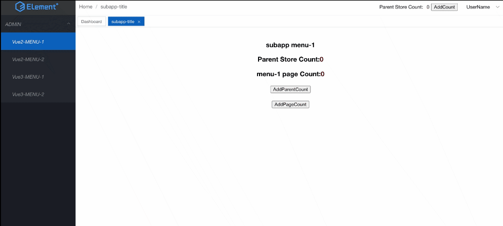

<p align="center">
  
</p>

# qiankun 微前端实践指南

## 快速上手
> node 版本 >= 14.0.0 <= 16.0.0
```
$ git clone git@github.com:Aaronlamz/qiankun-admin-practice.git
$ cd qiankun-admin-practice
```

```
yarn demo:install
yarn demo:start
```
本地访问 [`http://localhost:8080/admin/index.html`](http://localhost:8080/admin/index.html)


## 参考
- [qiankun 微前端实践指南](https://www.ultimate-kernel.fun/open-course/qiankun/)
- [qiankun 官方文档](https://qiankun.umijs.org/zh/guide)
- [single-spa 官方文档](https://github.com/single-spa/single-spa)
